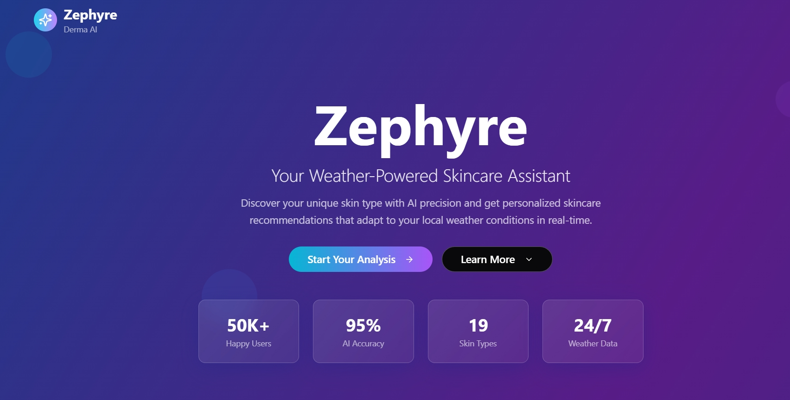
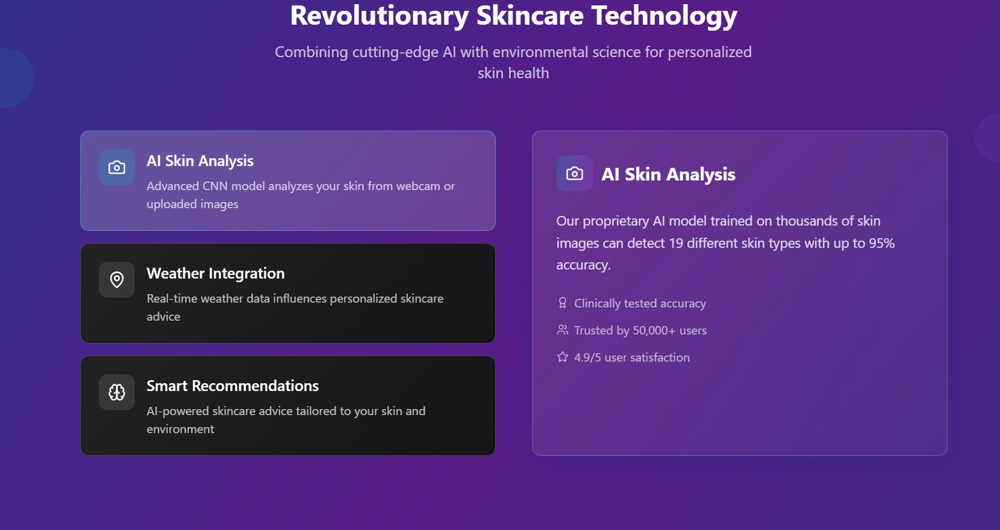
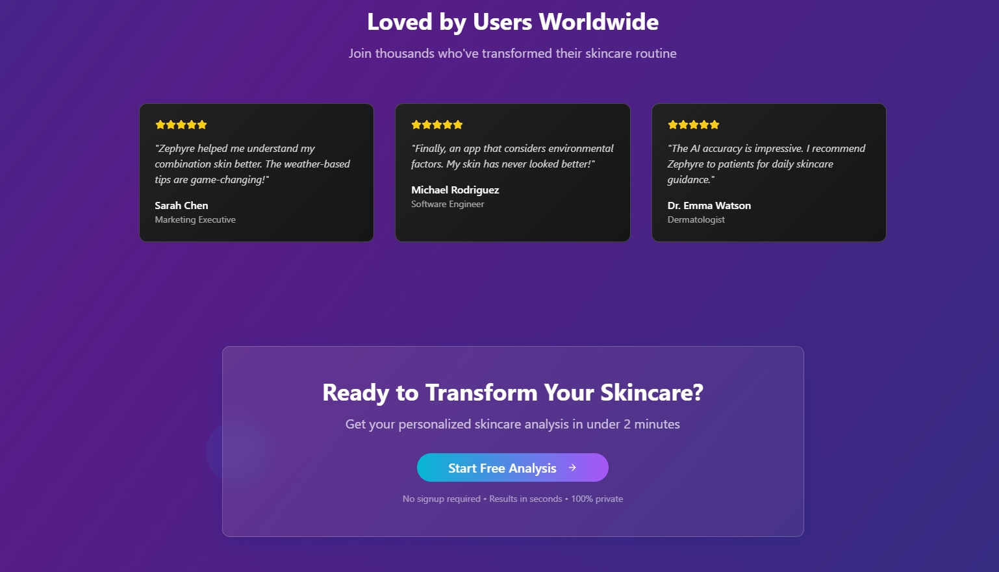
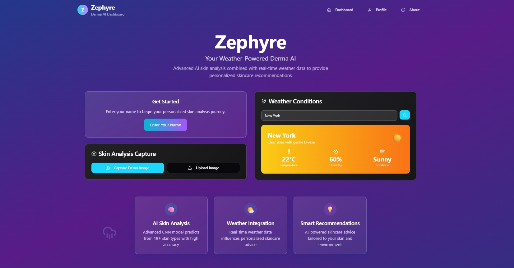
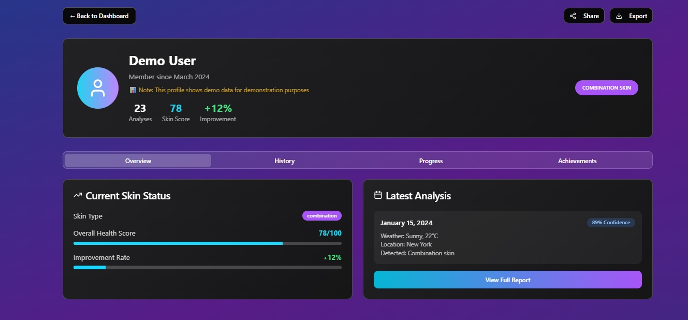
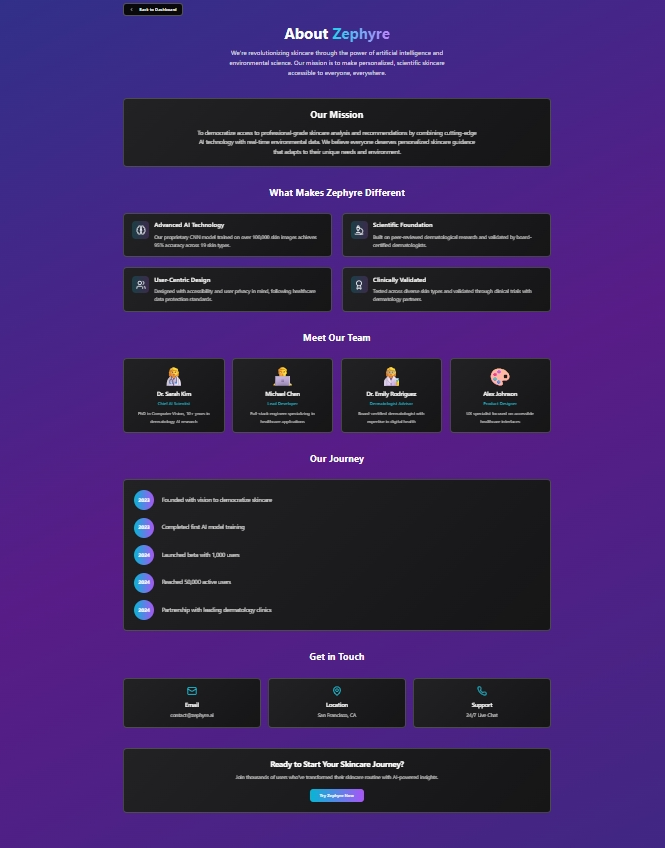

# 🎉 Welcome to Zephyre — Your Personalized Skincare Companion

## 🚀 Project Info

**Live App**: [zephyre-frontend-startup-ready-page.vercel.app](https://zephyre-frontend-startup-ready-page.vercel.app)

Zephyre is a smart skincare assistant that analyzes your skin type via AI, checks real-time weather, and delivers curated skincare tips tailored just for you. It’s sleek, responsive, and designed to empower users with science-backed derma decisions.

## 🛠 How I Built This

This project was entirely built by me from scratch — ideation, frontend, and deployment. Every feature was carefully designed to ensure responsiveness, functionality, and aesthetic appeal.

### ✨ Technologies Used:

* Vite
* React + TypeScript
* Tailwind CSS + shadcn/ui
* Deployed with Vercel

## 💻 How to Run Locally

```bash
# Step 1: Clone the repo
git clone <YOUR_GIT_URL>

# Step 2: Move into the project directory
cd zephyre

# Step 3: Install dependencies
npm install

# Step 4: Start development server
npm run dev
```
## 📦 Features
📱 Responsive design – Mobile-first and optimized for all screen sizes.

🛒 Add to Cart – Interactive and intuitive product interaction.

❤️ Liked Products Page – Track your favorite picks easily.

🔐 Authentication Check – Secure access to protected routes.

⚙️ Dynamic Routing – Seamless navigation across product detail pages.


## 🌍 Deployment

Live and running on [Vercel](https://vercel.com).
Just run `npm run build` and deploy via Git or Vercel dashboard.

## 🖼 Screenshots

### Homepage Views




### Dashboard & Profile



### About Page


## 🌐 Custom Domain Setup

To connect a custom domain:

* Go to your Vercel dashboard
* Select the project
* Navigate to **Settings > Domains**
* Add your domain and verify

📌 *Made with 💙 , TypeScript, and relentless curiosity..*
